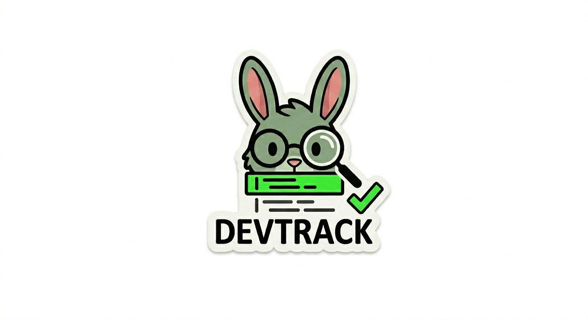

🇺🇸 English | 🇨🇴 [Español](README.es.md)

<p align="center">
  
</p>

# DevTrack

[](https://pypi.org/project/devtrack-local/)
[](https://pypi.org/project/devtrack-local/)
[](LICENSE)
[](https://github.com/Fedgutcor/DevTrack/actions/workflows/ci.yml)

Local-first development activity tracker. Tracks lines written, files edited, sessions, and Bash commands — with a web dashboard and optional AI summaries via Ollama.

**No data leaves your machine. No accounts. No API keys.**

---

## Quick install

```bash
pip install devtrack-local
devtrack start
```

Dashboard opens at `http://127.0.0.1:17321`.

---

## Requirements

- Python 3.11+
- macOS (LaunchAgent integration) or Linux (manual start)
- [Ollama](https://ollama.com) — optional, for local AI summaries

---

## Usage

```bash
devtrack start        # Start daemon + open dashboard in browser
devtrack stop         # Stop daemon and remove LaunchAgent
devtrack open         # Open dashboard (daemon must be running)
devtrack status       # Show running status + dashboard URL

devtrack              # Today's summary in terminal
devtrack week         # Last 14 days history
devtrack files        # Files edited today
devtrack help         # Full command list
```

---

## Dashboard

Web dashboard at `http://127.0.0.1:17321`:

- Daily metrics: lines written, files edited, sessions, Bash commands
- Bar chart for the last 7 days
- Most-edited files table with project + language detection
- Contribution heatmap (GitHub-style, last 8 weeks)
- AI productivity summary (requires Ollama)

Auto-refreshes every 30 seconds.

---

## Optional: AI summaries with Ollama

No internet required. No API keys.

```bash
brew install ollama
ollama pull qwen2.5-coder:3b
# Optional: use the DevTrack Modelfile
ollama create qwen-dev -f Modelfile.qwen-dev
```

Once Ollama is running, the "Day Summary" block in the dashboard activates automatically.

---

## Data & privacy

All data is stored locally:

```
~/.local/share/devtrack/devtrack.sqlite3
```

The daemon listens on `127.0.0.1:17321` and is NOT exposed to the network.

---

## Uninstall

```bash
devtrack stop
pip uninstall devtrack-local
rm -rf ~/.local/share/devtrack/
```

---

## Contributing

See [CONTRIBUTING.md](CONTRIBUTING.md).  
Spanish speakers: see [docs/es/contribuir.md](docs/es/contribuir.md).

---

## Made by

Built by [Ultragresion](https://ultragresion.com) — because saying *"I wrote a lot of code today"* hits different when you have a heatmap to prove it.
